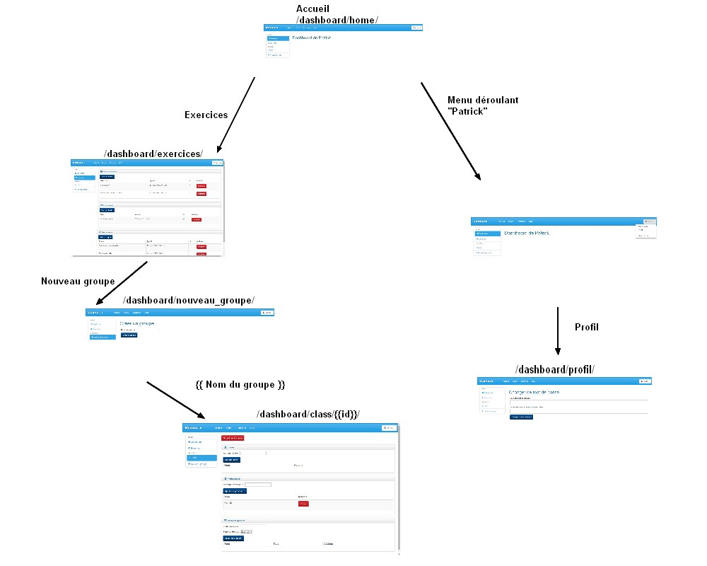
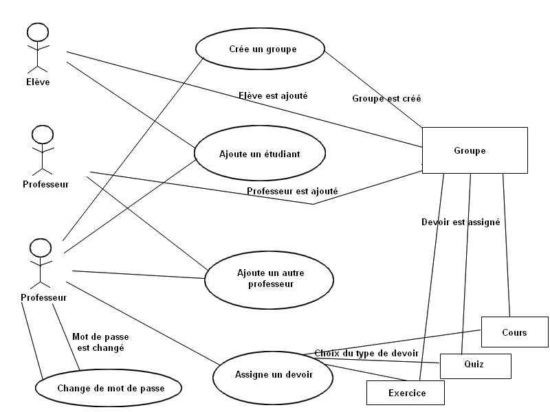
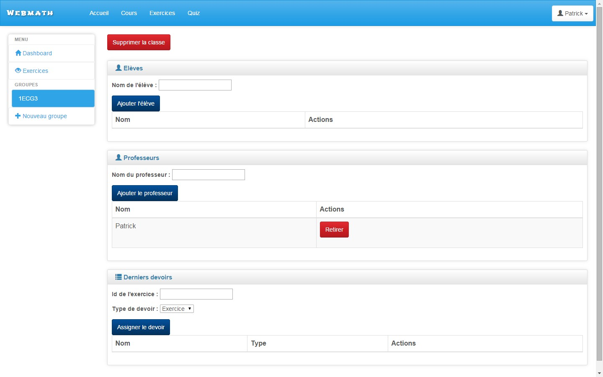
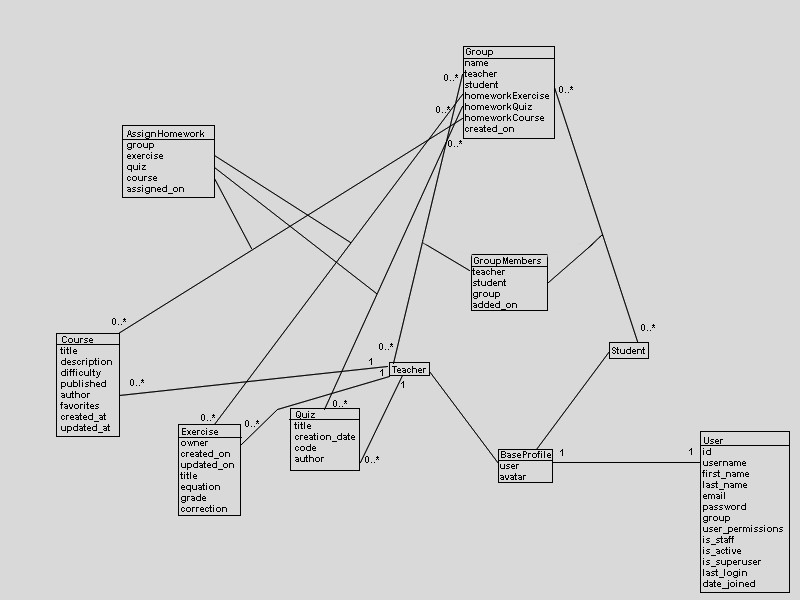

#################################
Guide du développeur
#################################

La deuxième partie de cette documentation consiste en une explication du
fonctionnement de l'application du côté du développeur.

Il est donc expliqué comment les vues, modèles ou urls de cette application
fonctionnent et l'utilité de certains fichiers. Il y a aussi des schémas
permettant de mieux comprendre le fonctionnement du tableau de bord.

Démarrer Django dans un workspace Cloud9
=========================================

Cloud9 est un éditeur de code en ligne permettant de programmer depuis n'importe
où. Cette plateforme a été utilisé pour le développement de l'application.

Voici les quelques étapes à suivre pour démarrer Django dans Cloud9 [#f2]_
[#f3]_.

Il faut tout d'abord créer un workspace.

**Attention, si on souhaite utiliser Python3 il est conseillé de créer un
workspace de type Custom, comme sur la photo suivante:**

..  figure:: images/Workspace.jpg
    :width: 60%
    :align: center
    
    Créer un workspace de type Custom
    
Une fois sur le dépot, il faut tout d'abord installer Django avec
la commande suivante:

::
    
        sudo pip3 install django==1.7
    
Django installé, il faut démarrer un projet avec la commande suivante:

::      

        django-admin startproject nom-pour-le-projet
        
Maintenant que le projet existe, il est possible de créer autant d'applications
que souhaité avec la commande:

::

        python3 manage.py startapp nom-pour-l'application
        
Pour lancer le serveur, il est nécessaire de taper cette commande:

::

        python3 manage.py runserver $IP:$PORT

Navigation
==============

    
    Schéma de navigation du site
    
Ce schéma explique les relations qui existent entre les différentes pages. Plus
précisément, comment accéder une page depuis une autre.

Il est important de noter que le menu déroulant ainsi que les pages Exercices,
Nouveau groupe et la page d'une classe peuvent être atteintes depuis n'importe
quelle page du tableau de bord.

Use Cases
==========

    
    Schéma résumant les actions qui se déroulent selon les utilisations du
    professeur
    
Ce schéma explique les différentes actions qui se passent lorsque le professeur
veut utiliser une des fonctionnalités du tableau de bord.

Par exemple, s'il veut ajouter un élève dans un de ses groupes, il n'a qu'à
entrer son nom, le serveur ira le chercher et l'ajoutera dans le groupe.

Dossier ``static``
==================

Le dossier static est utilisé pour garder tous les fichiers tel que
les fichiers CSS ou les fichiers Javascript. 
Dans cette application, il contient les dossiers suivants:

*   ``bower_components``: ce dossier contient tous les éléments du front-end
    qui possèdent des dépendances, comme les fichiers ``bootstrap`` ou des
    fichiers de base pour ``jquery``. Le dossier ``bower_components`` contient
    les fichiers relatifs au thème Bootstrap utilisé. Plus précisément, il
    contient le ``css`` et le ``javascript``.
    
*   ``css``: dans ce dossier se trouvent tous les fichiers ``css`` qui sont
    nécessaires pour le design du site. La différence entre les fichiers qui
    se trouvent dans ce dossier et les fichiers ``css`` du dossier
    ``bower_components`` est que les premiers servent de base et ne sont pas
    adaptatifs alors que les derniers permettent les changements de place et
    de taille que nous offre l'adaptivité de Bootstrap.
    
*   ``fonts``: le dossier ``fonts`` de l'application tableau de bord contient toutes
    les informations relatives aux petits signes (``glyphicons``) qui sont
    utilisés dans le tableau de bord, comme le + devant «Nouveau groupe».
    

    
    Exemples de ``glyphicons`` dans le menu de gauche: l'oeil ou la maison
    
Gabarits
========

Dans le dossier ``templates`` se trouvent tous les fichiers ``html`` servant
de gabarits à l'application:

*   Le gabarit ``classe.html`` contient le gabarit utilisé pour l'affichage
    des groupes. Il affiche tout d'abord le nom du groupe ainsi que la date de
    sa création, puis chaque élève et professeur ainsi qu'un bouton pour 
    les retirer du groupe. Dans les tableaux affichant les élèves et professeur
    est aussi affiché un bouton pour rajouter des membres. S'il est impossible
    d'ajouter le membre dont le nom a été rentré, le gabarit retourne un
    message d'erreur.
    
    Il affiche enfin les devoirs par type d'activité (exercice, quiz, cours) et
    un bouton pour les retirer. Il y a aussi un bouton pour assigner des
    devoirs. De nouveau, si aucune activité n'a été trouvée, le gabarit
    retourne un message d'erreur.
    
*   Le gabarit ``newclass.html``, lui, sert à créer un nouveau groupe qui pourra
    ensuite être supervisé. Il ne fait qu'afficher un champ pour le nom et un
    bouton de confirmation. Une fois le groupe créé, un message de confirmation
    est retourné.
    
*   Le gabarit ``index.html`` ne contient pour le moment que le nom
    d'utilisateur du professeur actuellement connecté. Il contiendra plus tard
    des statistiques quant aux groupes ou aux activités du professeur.

*   Le gabarit ``exercises.html`` affiche les exercices, les quiz et les cours
    qui ont été créés par le professeur. Ces activités sont supprimables depuis
    cette page et le professeur a la possibilité d'accéder aux formulaires de
    création d'activité. Il peut aussi voir quand ces activités ont été créées.
    
*   Le gabarit ``profile.html`` sert au changement de mot de passe. Il affiche
    deux champ qui doivent être remplis de façon identique. Si le changement
    de mot de passe a bien pu avoir lieu, un message de confirmation est
    retourné. Dans le cas contraire, un message d'erreur s'affiche.
    
Ces 5 gabarits ont tous la même structure de base:

*   Une bande au sommet de la page qui, une fois les applications ensemble,
    amènera l'utilisateur à ces applications.
    
    Il y a aussi un menu déroulant permettant d'accéder au tableau de bord,
    au changement de mot de passe et permettant aussi à l'utilisateur de se
    déconnecter.
    
*   Un menu à gauche de la page permettant d'accéder aux exercices, aux
    différents groupes qui sont tous ajoutés en liste et à l'option de création
    de groupe.
    

Fichiers importants
====================

Les applications Django possèdent les fichiers de base suivants:

*   ``models.py`` qui est utilisé pour créer les différents modèles et leur
    attribuer des champs.
    
*   ``admin.py`` est utilisé pour signaler à Django quels sont les modèles qui
    doivent apparaître dans l'application admin. Une fois qu'ils y apparaissent,
    il est possible de créer, modifier ou supprimer n'importe quel objet depuis
    cette application.
    
*   Le fichier ``forms.py`` est celui dans lequel on peut entrer les différents
    formulaires dont l'on a besoin pour l'application.
    
*   C'est dans ``views.py`` que l'on peut stocker des variables nécessaires
    dans certains gabarits, mais aussi réaliser certaines actions comme la
    suppression d'un objet. A la fin d'une vue, on retourne souvent un fichiers
    ``html`` ou on redirige vers une autre vue.
    
*   Le fichier ``urls.py`` contient les informations concernant les différentes
    urls accessibles par l'utilisateur et quelles vues sont censées être
    utilisées.
    
Fichiers uniques de Django
***************************

On peut modifier le fichier ``settings.py`` afin de définir la zone temporelle
dans laquelle on se trouve, mais aussi les applications qu'un projet doit
gérer ou encore l'emplacement du fichier ``static``. Il sert donc de
configuration de base pour un projet.

Il y a aussi un autre fichiers ``urls.py`` qui, lui, est très utile si l'on doit
s'occuper de plusieurs applications à la fois. En effet, on peut définir le
début de l'url et rediriger vers un autre fichier ``urls.py``.

Modèles
========

Modèles utilisés pour le tableau de bord
*****************************************
    
Il y a tout d'abord le modèle ``BaseProfile`` qui découle de ``User`` et qui,
comme son nom l'indique, va servir de profil de base pour le modèle ``Teacher``
et ``Student``.

L'utilisateur Django possède de base les caractéristiques suivantes [#f1]_:

*   ``username``: nom d'utilisateur
*   ``first_name``: prénom
*   ``last_name``: nom
*   ``email``: adresse courriel
*   ``password``: mot de passe
*   ``group``: les relations avec le modèle ``Group`` de Django
*   ``user_permissions``: les relations avec le modèle ``Permission`` de Django
*   ``is_staff``: si l'utilisateur peut accéder à l'application admin
*   ``is_active``: définit si l'utilisateur doit être considéré comme actif ou
    non
*   ``is_superuser``: définit si l'utilisateur a tous les droits
*   ``last_login``: dernière connexion de l'utilisateur
*   ``date_joined``: date de création de l'utilisateur

Car un professeur a besoin de voir ses exercices, quiz et cours, et pourra les
assigner en tant que devoirs à un groupe, les modèles Exercise, Quiz et Course
ont tous les trois été apportés.

Il y a ensuite le modèle ``Group``, qui n'est pas le même que celui implémenté
de base avec Django, car c'est celui qui a été utilisé pour les groupes d'un
professeur. Les membres sont ajoutés par le biais du modèle ``Groupmembers``
qui sert de table intermédiaire entre ``Student`` ainsi que ``Teacher`` et
``Group``. Le modèle ``AssignHomework``, qui est aussi une table intermédiaire,
sert à l'affectation de devoirs entre ``Exercise``, ``Quiz``, ``Course`` et
``Group``.

Diagramme UML
***************

    
    Schéma résumant les relations entre les différents modèles
    
Sur ce schéma, les types de lien existant entre les différents modèles sont plus
visibles:

*   ``0..*`` signifie qu'un objet peut possèder entre zéro et l'infini objets
    appartenant à l'autre modèle
    
*   ``1`` signifie qu'il ne peut en posséder qu'un seul

Il est aussi facile à voir la place que prennent les tables intermédiaires
``AssignHomework`` et ``GroupMembers``: elles servent de ponts entre deux
modèles.

Vues
=====
    
Toutes les vues vont devoir chercher le professeur correspondant à
l'utilisateur actuellement connecté. Cela permettra à chaque fois d'aller
chercher les données correspondantes comme le nom d'utilisateur toujours
affiché sur le menu déroulant en haut à droite de la page.
    
La vue ``home`` sert uniquement à distinguer la première lettre du nom
d'utilisateur pour qu'apparaisse dans le gabarit «de» ou «d'».

La vue ``exercises``, elle, ne cherche rien de plus. L'utilisateur nous
permettra d'accéder aux exercices, quiz et cours qui lui sont associés mais
tout ceci est directement recherché dans le gabarit.

C'est grâce à la vue ``newgroup`` qu'un professeur peut créer un groupe. S'il
veut créer un groupe, la vue se contentera de créer un groupe associé au nom
et de créer un lien entre le professeur et le groupe grâce à la table
intermédiaire ``GroupMembers``. La variable ``success`` a pour utilité
d'afficher un message de confirmation dans le gabarit ``newclass.html`` une
fois le groupe correctement créé.

La vue ``profil`` est celle utilisée pour le changement de mot de passe. Elle
compare les deux mots de passe entrés. Si les deux mots de passe correspondent,
le mot de passe est attribué à l'utilisateur et, grâce au gabarit
``profile.html`` et à la variable ``success``, un message est retourné pour
confirmer le changement. Dans le cas contraire, un message d'erreur est
retourné.

La vue ``groupe``, elle, est composée de plusieurs actions qui dépendent de la
forme qui a été remplie. 

*   Il y a tout d'abord ``addTeacher`` qui, quand l'utilisateur entre le nom
    d'utilisateur d'un autre professeur pour l'ajouter dans un groupe existant,
    va créer un object ``GroupMembers`` entre ce professeur et le groupe actuel
    pour qu'il fasse parti de ce groupe. Il se passe la même chose pour
    ``addStudent`` si le même utilisateur décide d'ajouter un élève.
    
*   Pour assigner un devoir à un groupe, la vue va utiliser ``assignHomework``
    qui, selon le genre d'activité et le numéro qui ont été sélectionnés par
    l'utilisateur, va chercher l'activité et créer un objet ``AssignHomework``
    qui va lier l'exercice, le quiz ou le cours au groupe.
    
*   Pour supprimer un groupe, il y a d'abord l'utilisation de ``deleteClass``
    qui va uniquement servir à l'apparition d'un deuxième bouton qui activera
    ``deleteClassConfirm``, qui supprimera le groupe et donc tous les objets
    ``AssignHomework`` et ``GroupMembers`` avec lesquels il était associé.

Cette vue va par la suite retourner le gabarit ``classe.html`` avec les
variables définies au début qui apparaîtront sur la page.

Finalement, quelques vues ont été réalisées pour des actions plus complexes.
Par exemple, ``deleteFromGroup`` avait besoin de deux variables, ``member_id``
et ``group_id``. Cette vue a donc été liée à une url nécessitant ces deux
variables. La vue ``deleteFromGroup``, composée de ``deleteStudent`` et
``deleteTeacher``, servent à retirer les membres d'un groupe en supprimant
l'objet ``GroupMembers`` qui les liait. La vue ``deleteActivity``, qui elle est
composée de ``deleteExercise``, ``deleteQuiz`` et ``deleteCourse`` sert à
supprimer une activité depuis son tableau de bord. Enfin, ``deleteHomework`` permet
au professeur de retirer un devoir précédemment assigné selon le type d'activité
auquel il correspond.

Urls
=====
    
Les urls ``home``, ``group_view``, ``exercises``, ``newgroup`` et ``profil``
redirigent simplement aux vues du même nom.

Les urls ``deleteFromGroup``, ``deleteActivity`` et ``deleteHomework``, elles,
sont reliées aux vues du même nom qui permettent certaines actions dépendantes
de variables très précises. Pour réaliser ceci, des formes ont été créées dans
les gabarits redirigeant à ces urls et possédant les variables nécessaires afin
que le programme puisse aller chercher les objets souhaités et permettre, par
exemple, la suppression d'une activité.

.. rubric:: Note de bas de page

..  [#f1] «django.contrib.auth»,
    consulté le 23.03.2015,
    https://docs.djangoproject.com/en/1.7/ref/contrib/auth/

..  [#f2] «Cloud9 - Your development environment, in the cloud»,
    consulté le 29.03.2015,
    https://c9.io/

..  [#f3] «Configuration de Django 1.7 sous Cloud9»,
    consulté le 24.03.2015,
    http://www.donner-online.ch/webtutos/django/c9config.html