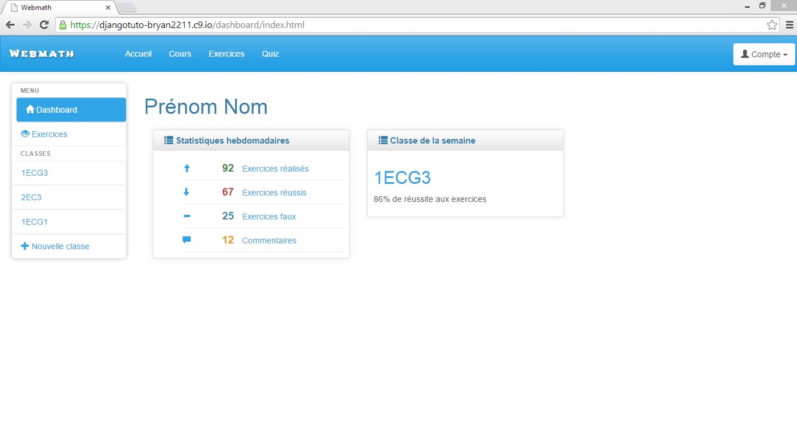
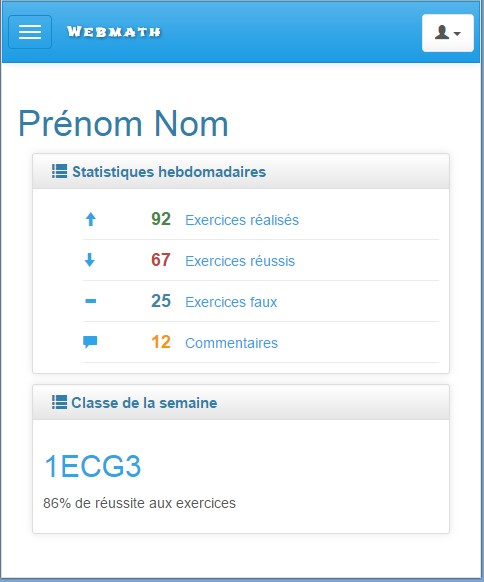
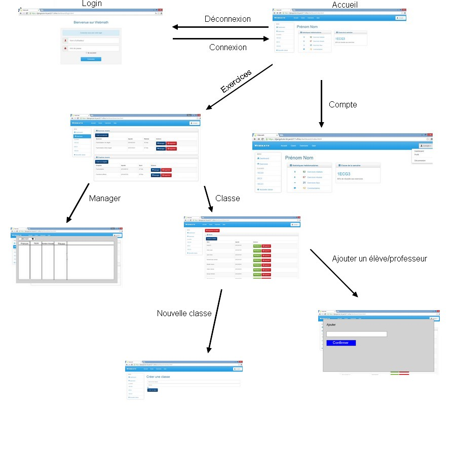
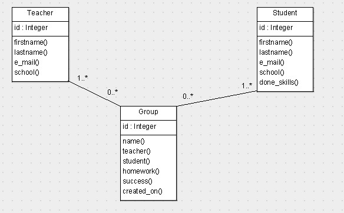

#################################
Documentation
#################################

Différentes technologies
==========================

Pour créer mon application ( dashboard professeur ), j'ai fait recourt aux
technologies suivantes.

HTML5 (Hypertext Markup Language)
**********************************

HTML est la base de toute page web. En effet, c'est ce qui nous permet
d'afficher du texte, des images. Il est principalement utilisé avec CSS (pour la
mise en page) et JavaScript (pour l'interactivité des pages).

J'ai utilisé HTML5 pour faire le frontal ( plus connu sous le nom front-end ). 
Le frontal correspond à ce que l'utilisateur voit. Il est opposé au back-end,
qui est la partie qui travaille derrière mais que l'utilisateur ne voit pas.

CSS3 (Cascading Style Sheets)
*******************************

CSS3 a été utilisé pour mettre en page mon code HTML. Cela a donc aussi
contribué à la partie front-end de mon application. C'est CSS qui permet de
modifier la police du texte, modifier la taille des images, ou encore
de modifier la couleur du font. CSS permet donc de rendre une page potable
pour l'oeil.
    
Bootstrap
***********

Bootstrap est un framework qui contient du code HTML et CSS. J'ai utilisé
Bootstrap comme base pour mon dashboard en utilisant le modèle *Charisma* 
[#f1]_. L'avantage de Bootstrap est qu'il offre des
design adaptatifs, qui signifie que la mise en page va s'adapter à la taille de
l'écran.

Voici un exemple d'adaptation:

Voici à quoi ressemble le dashboard sur un écran d'ordinateur.

Et voici ce que la page devient si l'on zoome ou si l'on réduit la taille de la
fenêtre.
    
Django
*******

Django est un framework spécialisé dans Python. C'est un des framework les plus
utilisés. Nous avons choisi Django pour le projet car, travaillant sous Python,
il est le plus documenté et le plus connu.

Grâce à Django, nous avons pu gérer des classes et des héritages, des vues et
des urls.

Git et Github
**************

J'ai utilisé Git et Github pour garder une trace de l'avancement de mon travail
et pouvoir rattraper toute erreur qui, dans le passé, m'aurait échappé et
referait surface plus tard. 

Grâce à Git, j'ai donc pu créer des commit, qui sont
des entrées permettant au développeur de faire des sauvegardes et de voir à quel
moment il a modifié certains éléments selon la légende qu'il a mit au commit.
J'ai aussi pu aller chercher et remettre des informations sur le répositoire
sur le site Github. En effet, il garde les copies des fichiers, ce qui permet
de pouvoir les récupérer depuis n'importe quelle machine.

Cloud9
*******

Enfin, j'ai utilisé Cloud9, un site qui permet de programmer sur un serveur
se trouvant autre part, et de pouvoir y accéder depuis n'importe quelle machine.

La raison pour laquelle j'ai finalement favorisé la programmation sur Cloud9
plutôt que la programmation locale est le fait que, étant donné que je profite
de programmer quand j'ai du temps et que je n'ai pas forcément une de mes
machines, je peux le faire depuis l'ordinateur de quelque d'autre sans devoir
télécharger multiples fichiers.

Application au projet
======================

Dans le projet final, qui, rappelons-le, consistera en un site d'e-learning pour
les mathématiques, ma partie pratique sera le dashboard professeur, donc
l'endroit ou les professeurs pourront gérer leurs exercices, leurs classes et
leurs élèves. La raison pour laquelle cette partie du site est si importante
est que sans un dashboard parfaitement opérationnel, il deviendrait chaotique
pour les professeurs de gérer leurs différentes responsabilités.

Toutes les fonctionnalités ayant déjà été expliquées auparavant, je ne vais pas
repasser dessus.

Wireframes, ou "scénarios du site"
===================================

Modèles et diagrammes UML
==========================

Modèles utilisés
******************

Il y a tout d'abord notre classe Teacher, qui constitue bien évidemment le
point central de notre application. La classe Teacher possède les propriétés
suivantes: prénom, nom, adresse e-mail et l'école dans laquelle il enseigne.
Il n'y a pas réellement d'autres propriétés à lui rajouter.

Pour qu'il y ait des professeurs, il faut aussi des élèves, c'est pourquoi
j'ai une classe dénommée Student. Les propriétés ressemblent beaucoup à celles
de Teacher étant donné que les deux classes correspondent à des classes
d'utilisateur. Ces propriétés sont: prénom, nom, adresse e-mail, école et
compétences de l'élève, établies par rapport à certains thèmes accomplis.

Finalement, ces deux classes sont réunies dans une classe nommée Group, qui
pourrait s'apparenter à une classe d'école. En effet, la classe Group possède
1 à plusieurs professeurs, 1 à plusieurs élèves, un nom, des devoirs, des
taux de réussites par rapport aux exercices réalisés en général, et une date
de création.

Diagramme UML
***************

Ce diagramme UML explique donc les relations entre les différentes pages de mon
application, comment y accéder, que font les boutons, etc.

Implémentation avec le reste du projet
=======================================

Comme déjà expliqué, ma partie, le dashboard professeur, servira de lieu de
référence pour le professeur qui utiliserait le site. En effet, c'est seulement
depuis cette partie qu'il pourra gérer tout ce qui le concerne.

Certaines fonctionnalités, tel que la création d'exercices ou de chapitres,
feront appel aux applications de mes compagnons. En effet, le bouton devra aller
chercher les formulaires correspondant.

Les problèmes que nous pourrions rencontrer lors de la mise en commun de nos
différentes applications seraient des conflits, mais qui pourraient facilement
être gérables si on y fait attention en cherchant les erreurs.

.. rubric:: Note de bas de page

..  [#f1] http://usman.it/free-responsive-admin-template/